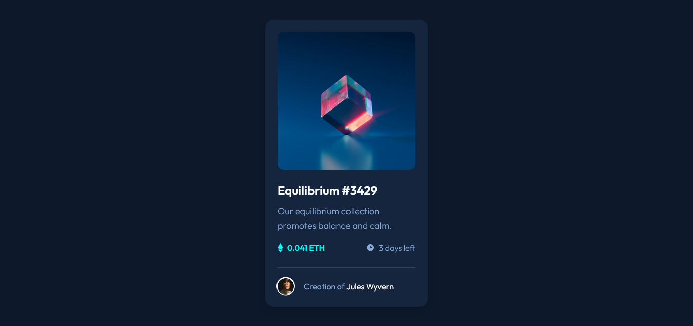

# Frontend Mentor - NFT Preview Card Component Solution

This is a solution to the [NFT preview card component challenge on Frontend Mentor](https://www.frontendmentor.io/challenges/nft-preview-card-component-SbdUL_w0U). Frontend Mentor challenges help you improve your coding skills by building realistic projects.

## Table of contents

- [Frontend Mentor - NFT Preview Card Component Solution](#frontend-mentor---nft-preview-card-component-solution)
  - [Table of contents](#table-of-contents)
  - [Overview](#overview)
    - [The challenge](#the-challenge)
    - [Screenshot](#screenshot)
    - [Links](#links)
  - [My process](#my-process)
    - [Built with](#built-with)
  - [Author](#author)

## Overview

### The challenge

Users should be able to:

- View the optimal layout depending on their device's screen size
- See hover states for interactive elements

### Screenshot

### Links

- Solution URL: [To be added](https://your-solution-url.com)
- Live Site URL: [Deployed on Vercel](https://nft-preview-card-component-livid-chi.vercel.app/)

## My process

### Built with

- [Svelte](https://svelte.dev/)
- [WindiCSS](https://windicss.org/)
- Flexbox
- Mobile-first workflow
- Vite

## Author

- Frontend Mentor - [@Shawn Lee](https://www.frontendmentor.io/profile/OGShawnLee)
